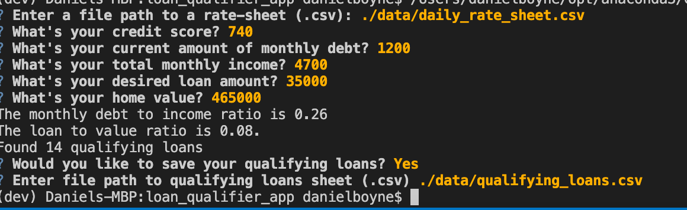

# **Loan Qualifier Application**
---
Python command-line interface application to view loans from lenders quickly by filtering data like credit score, debt to income, loan to value, and max loan size.

---

## Technologies

Uses python with :

* [fire]
* [questionary]

---

## Installation Guide

Intall both packages above.
```python
  pip install fire
  pip install questionary
```
---

## Usage

Find the directoy by entering:
```python
  python app.py
```
Then input file for data give on daily rate sheet followed by giving your credit score, monthly debt, monthly income, desired loan amount, and home value information. It will ask if you would like to save the list of qualifying loans.
**example**


---

### Contributors

Daniel Boyne - [E-mail](mailto:dboyne3@me.com)
---

### License

wtfpl
